# Travel To Tokyo
[2025] React web app portraying an initerary page in a fun and creative format. Highly inspired by old japanese magazines, the layout of the webpage emulates a similar style, combining collaging/crafting methods with web development and design.

## About the Project
Inspired by my two trips to Tokyo, I knew I wanted to create a page like this for months. Im not a person who typically likes to travel, but ever since I was in middle school I had always wanted to go to Japan. Finally having the chance to do that post graduation was a dream come true. When designing the page, I wanted something original and fun, something that meant I stayed true to my wacky mind, but also incorportated everything I had been learning about web development. I found some images of old japanese magazines on pinterest and I knew exactly then that that was the aesthetic I wanted for this page.

### Nav + Footer
Nav bar is simple, only displaying the itinerary days while all together ommiting any other sections. This was purposeful since the focus is on the itinerary and not on anything else. Allowing the user ease of access to the important sections.
The footer contains basic information in the left corner while displaying a creative 'barcode' as one would see on the back of a magazine in the right corner.

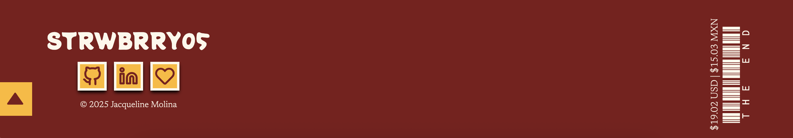

### Hero
Pictures taken from my own phone/trips; I decided to make the hero look flashy and attention-grabbing on purpose. Magazine covers are created with the intention to lure people in by seeing strong colors and shapes and text, so that is something I attempted to replciate with the hero here.

### Itinerary Days
All itinerary days are formatted using both CSS grid and CSS flexbox. All itineraries were additionally created from my own experiences in Tokyo, Japan.

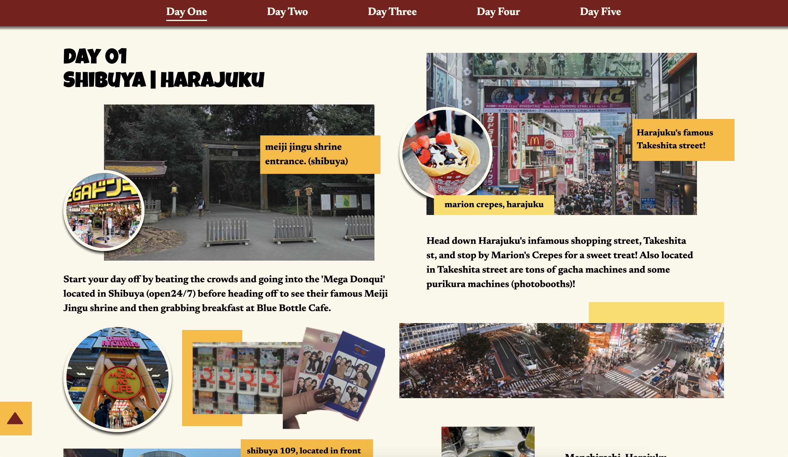
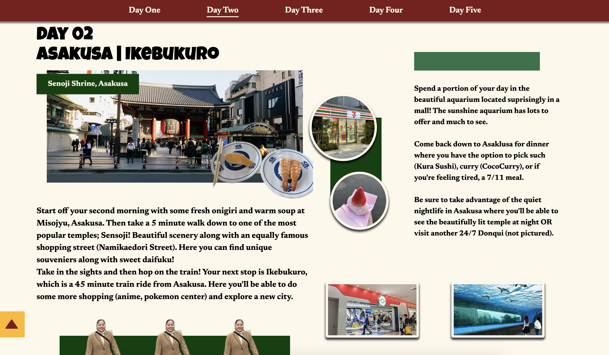
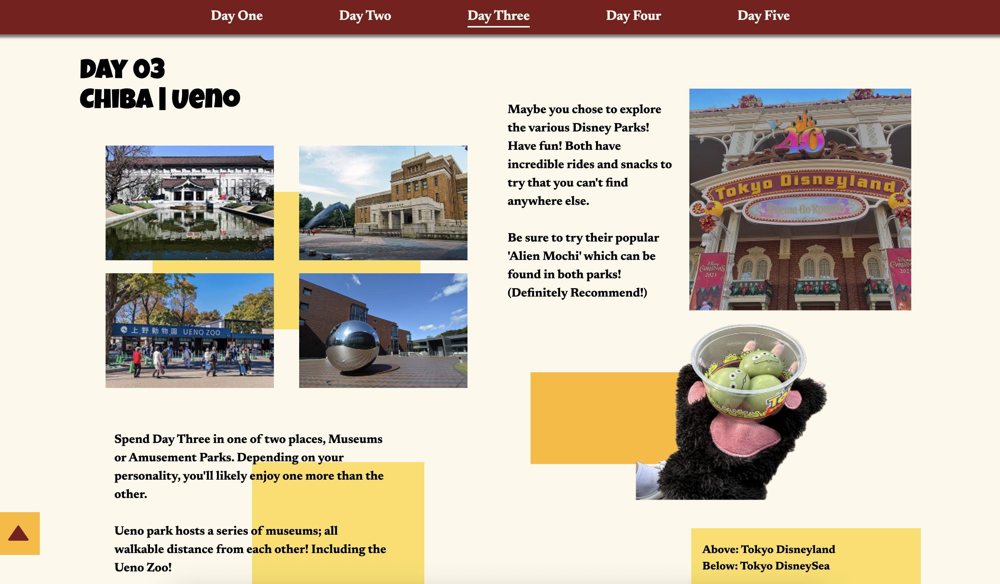
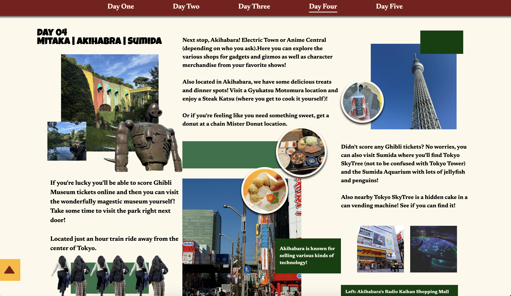
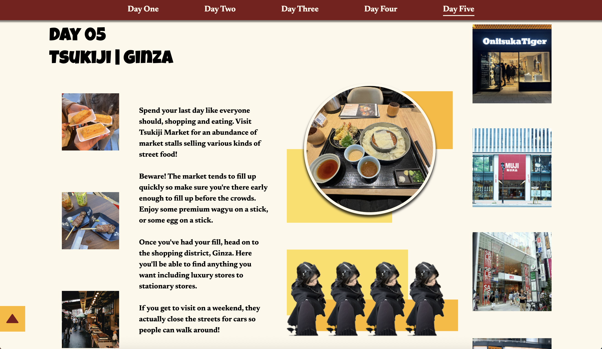

### Map
Created using the google maps API (which I now no longer have access to). A pin marks the city of Tokyo, Japan. Allowing users to look around on their own accord and find their own additional places to visit.

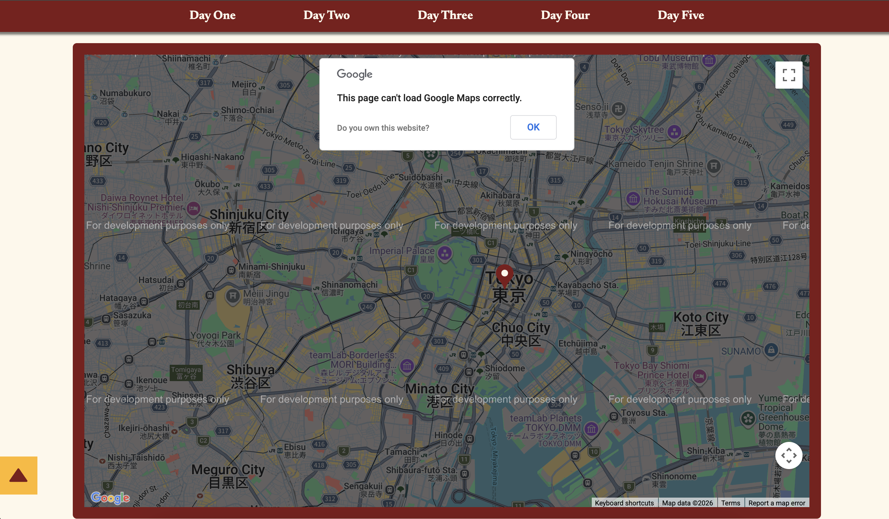

### FAQ
Most first time travelers have questions when going to new places. I placed this section as a means to help these individuals who would have asked simialr questions that I had. Developmentally, I also wanted to challenge myself on making an accordion faq section on my own for the first time. This challenge helped my future projects immensely.

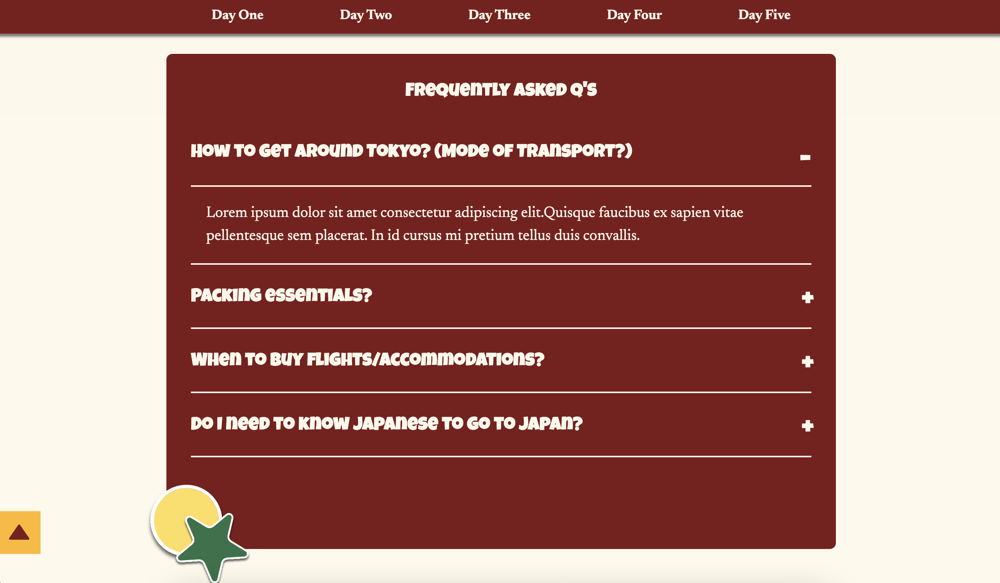

## Responsive View
Designed desktop first, developed mobile first. Page is responsive to multiple screen sizes.

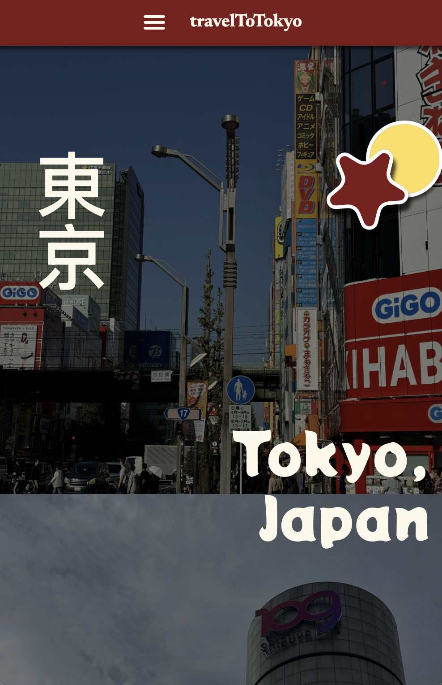
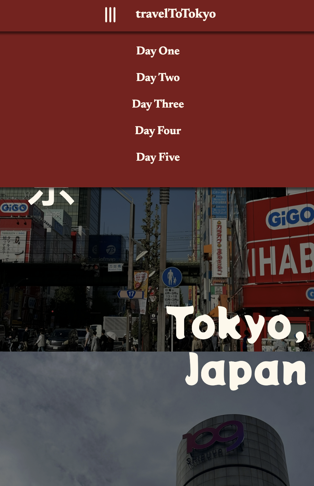
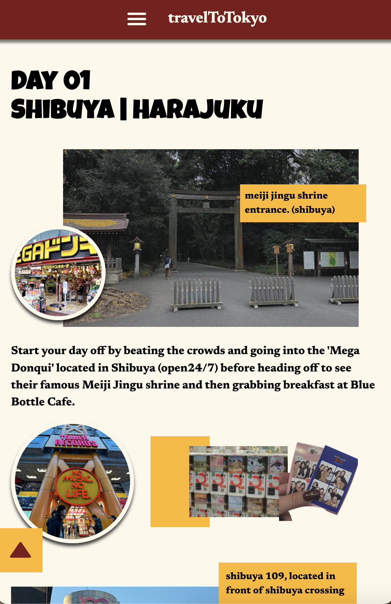
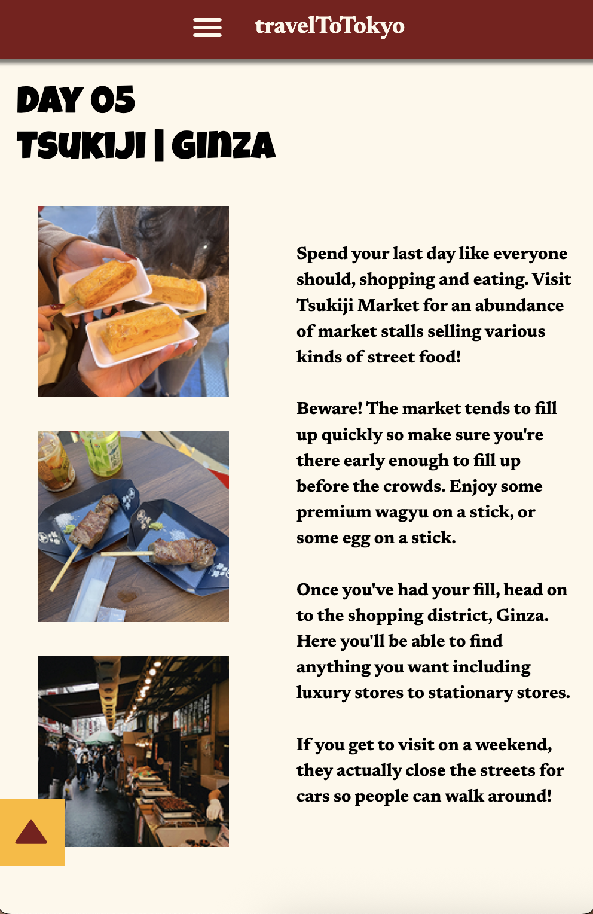
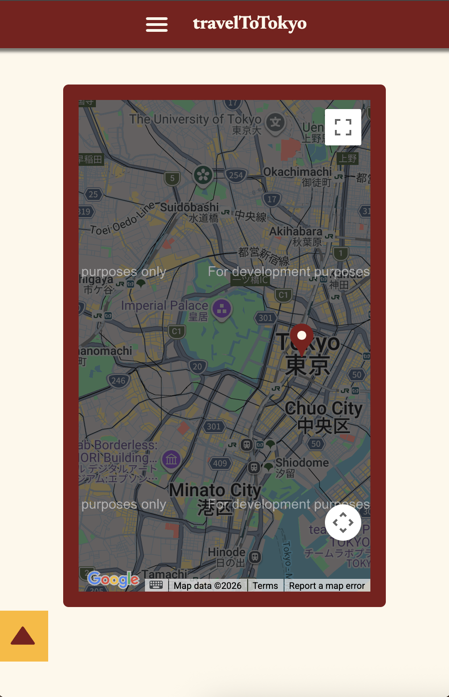
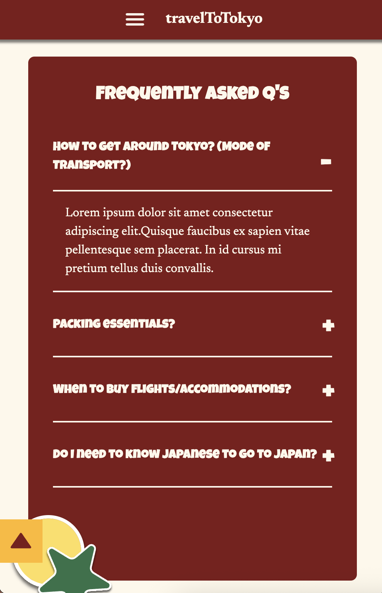

## Potential Improvements
- HERO: While visually, the hero looks exactly like I wanted it to. On occasion it makes the entire page load slowly. I would find a way to create a more efficient hero by minimizing the amount of behind the scenes work the page has to do.

- ITINERARY: Developmentally, everything is up to my ideals. Stylistically, I would have liked to have added more images and text. Created a real chaotic looking itinerary that somehow works against all odds.

- MAP: Only critique I have for the map was that I wasn't able to create and drop multiple pins. At the time, I was only able to figure out how to add one pin to the map. Ideally, I would have had a pin for each place/location I mentioned through the course of the five itienrary days. Here, the users would have been able to see all the locations for themselves.

- FAQ: Would have been nice to have added more questions/answers to the page.

## Built Using
- HTML
- CSS
- Tailwind CSS
- VSCode
- React + Vite
- NodeJS

## Contact
Any comments, questions, or concerns?\
Contact Jacqueline Molina: molina.jq19@gmail.com
